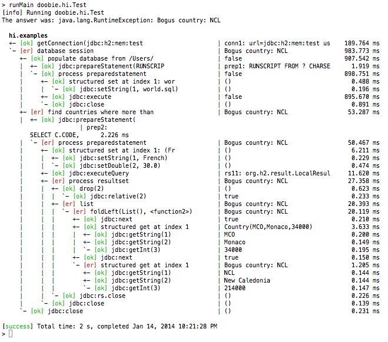

## doobie - mellow database access

**NOTHING TO SEE HERE ... WORK IN PROGRESS. GO AWAY.**

This is a small, pure-functional JDBC layer for Scala.

### Principles

 - Any JDBC program should be representable.
 - No vendor-specific stuff.
 - Functional and typesafe (natch).
 - Monadic API (no crazy DSL).
 - Write your own damn SQL.
 - Automatic resource management.
 - Structured logging.
 - ResultSets are processed as streams.

### Design Notes

###### Write your own SQL

Ok so why doesn't Doobie write SQL like Slick or Hibernate? Because it's a hugely complex general problem and every solution thus far (Slick, Hibernate, etc.) ends up being both limited in functionality and staggeringly complex in implementation. You always end up dropping down to native SQL, typically very quickly.

So I'm not screwing around with that. Write your own damn SQL. Preferably as stored procedures (which turns database access into an FFI problem).

###### Monadic Structure

After four implementations of the monadic structure I finally settled on a representation of effectual actions with state-passing that is about as simple as it gets: `Kleisli[IO, S, A]` where `S` is the underlying JDBC object.

Benefits:

 - It's very straightforward and very general.
 - Trampolining is provided by the outer `IO` monad.

Drawbacks:

 - It is possible to access the passed state, which is an unsafe thing to do because it's usually a lifetime-managed JDBC object that we would prefer to keep under wraps. 

 However: 

  - Doobie provides primitive actions for the entire JDBC API, so there should be no reason for the typical user to go digging for the underlying state.
  - You are unlikely to do so by accident, and if you do it on purpose we assume you know what you're doing.
  - Ultimately such a thing *must* be provided because vendor-specific APIs require access to these low-level objects. Doobie doesn't provide any vendor-specific actions but contributed libs might.

### Logging Example

In this contrived example the construction of a `Country` object fails because the developer arbitrarily refuses to recognize New Calendonia. The log is a rose tree reflecting the structure of the computation, where each node labels a computation and reports its result/failure value as well as accumulated time. Tooling will be able to interpret this structure to diagnose errors. 

Note that the structure has almost no relationship to the runtime stack trace because actions are executed in a `Free` interpreter; without a structured log like this it would be very hard to diagnose problems. This is a general issue for functional code where the construction and execution of computations are distinct processes.

The wrapping is messed up in one place, sorry. Need to sanitize the SQL.

